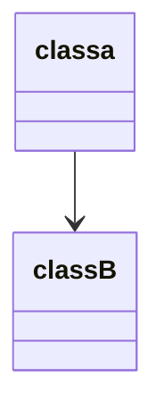

## XMLib介绍

XMLib是一个动作游戏编辑器

- 逐帧动作编辑
- 逻辑与表现分离
- 动作逻辑实现简单
- 可用于帧同步
- 支持2D与3D

> 💡 Github地址：[https://github.com/PxGame/XMLib.AM](https://github.com/PxGame/XMLib.AM)


## 类图（Mermaid）




## 执行顺序

- `GameManager`
  - `Awake()`：加载技能编辑器的配置文件，初始化Input数据类
  - `Update()`“：
    - InputUpdate：读取输入
    - LogicUpdate：这个函数确保了一种帧数稳定的Update实现
      - 执行`ActionMachineController.LogicUpdate`
      - ClearInputData：清空输入
  
- `ActionMachineController`
  
  - 挂载在一个Player的GameObject上作为
  - 指定配置文件
  - 引用animator、rigidBody、model、rotateSpeed等基础信息
  - 引用一个`IActionMachine`（实际上只有一个`ActionMachine`实现了这个接口）
  - `Start()`：
    - 初始化`(IActionMachine) actionMachine`
    - 根据`actionMachine`初始化播放的动画
    - 初始化其他数据
  - `Update()`：
    - `UpdateAnimation()`：根据一个timer与逻辑帧同步播放动画的实现
    - `UpdateRotation()`：根据旋转的速度来顺滑的播放模型的旋转
  - `LogicUpdate()`：
    - 逻辑Update，供`GameManager`统一调用
    - `actionMachine.LogicUpdate()`
    - `UpdateLogicAnimation()`：根据逻辑帧中写入的`eventTypes`来更新动画的播放时间（再在Update中更新动画的播放），与动画的切换融合
    - `CheckGround()`
  
- `ActionMachine`

  - 💡 这不是一个 `Monobehaviour`

  - 这个类本质时一个FSM，只是这个FSM的切换驱动都是基于数据的，保存在了config里，

    > 一个config 有多个 state，state之间的切换有配置的条件跳转的，有最后一帧回到默认状态的等等

  - 根据宏定义using到不同的`Single`数据类型和数学库

  - 初始化了很多的数据，包括顿帧信息、MachineConfig、StateConfig等

  - 包含`ActionNode`，分为普通的和global的（global的不受顿帧影响）

  - `LogicUpdate()`

    - `InitValue`：初始化触发的事件，这个事件也基本上就只是表现层的事件做播放动画用

    - `UpdateState() & UpdateGlobelFrame()`

      > 不受顿帧影响的`UpdateActions()`
      >
      > 其实我觉得 `UpdateFrame() & UpdateState()` ，这样调转了一下顺序反而更适合一些，下同

    - `UpdateState() & UpdateFrame()`

      > 

      

- `ActionNode`

  - 一个State中包含多个ActionNode，相当于一个个的游戏逻辑
  - `IActionMachine`，对所属FSM的引用
  - `config`是个什么概念？它还只是一个object类，分为 `IHodeFrames` `JumpConfig`等


### 动画是如何播放的

在`ActionMachineController` --> `Update()` --> `UpdateAnimation()` --> `Animator.Update()`

这里主动的去调用`Animator.Update()`，并且同时把`Animator`这个组件置为Disable（其实可以用Animancer代替，感觉更好？）

### 如何保证动画的播放与逻辑表现一致

在主动调用`Animator.Update()`的时候有一个条件限制：

- 动画的播放也分为逻辑与表现，都在`ActionMachineController`类中
- 每个逻辑帧都增加`animatorTimer`，含义为动画的逻辑timer
- 播放动画的脚本只在`animatorTimer`有值的时候才会执行`Animator.Update()`

### 顿帧是如何实现的

> 💡 关于为什么会有GlobalActions不受顿帧影响，原作者表示，受伤和AI不应当受顿帧影响

- 关于顿帧只需要指定顿帧的开始时间和顿帧的持续时间，然后在UpdateFrame中有这样一段代码

```
if (waitFrameDelay > 0)
{
	waitFrameDelay--;
}
else if (waitFrameCnt > 0) //顿帧
{ 
	waitFrameCnt--;
	return;
}

// ... 业务逻辑

// 这一段至关重要，上面的return导致这里不运行，直接决定了顿帧时动画不会播放
eventTypes |= ActionMachineEvent.FrameChanged;
```

### 顿帧的优化空间

进入顿帧的时候，可以放出一个动画事件，使得动画表现有轻微的抖动，甚至可以定制抖动的方向（左右抖动还是上下抖动等）

